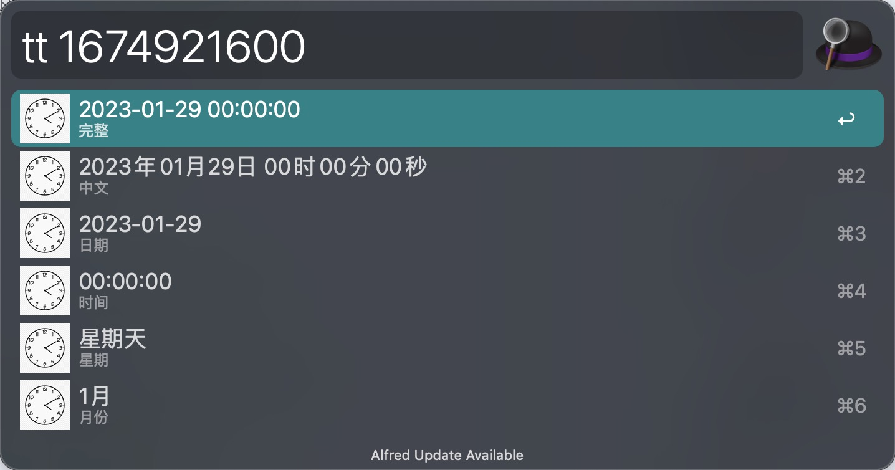
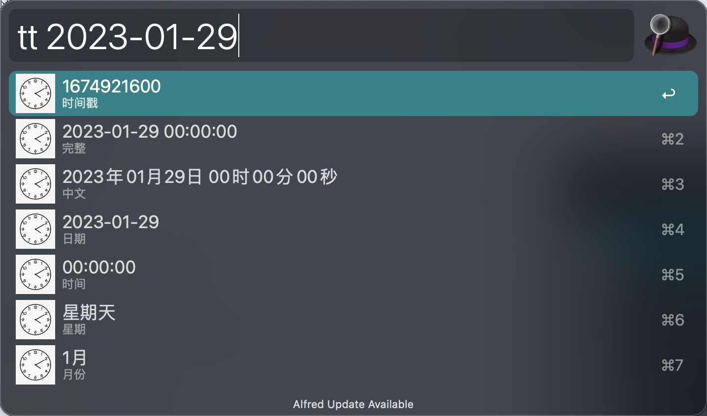
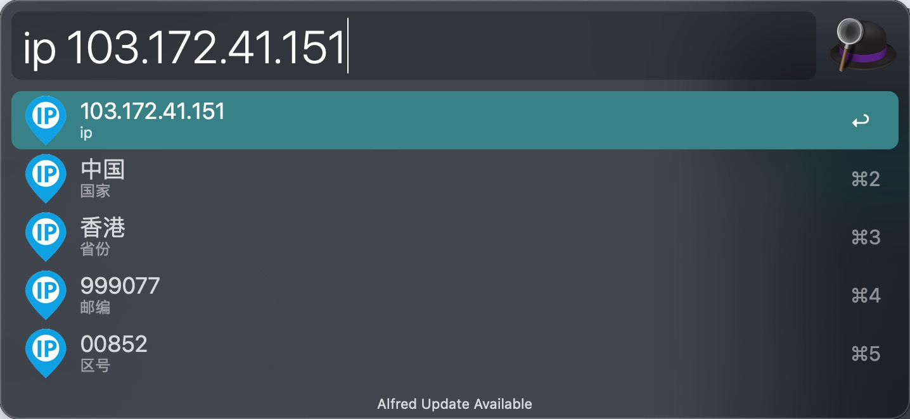
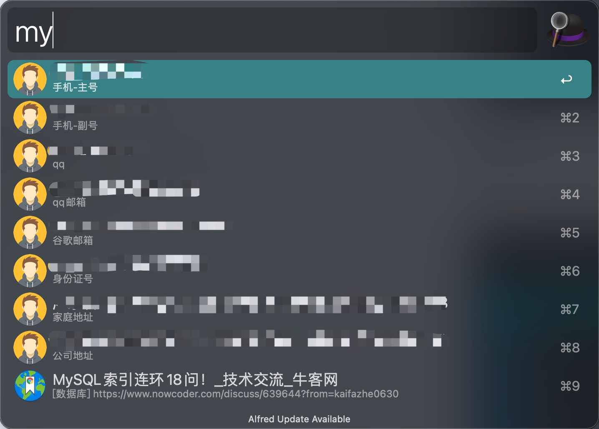
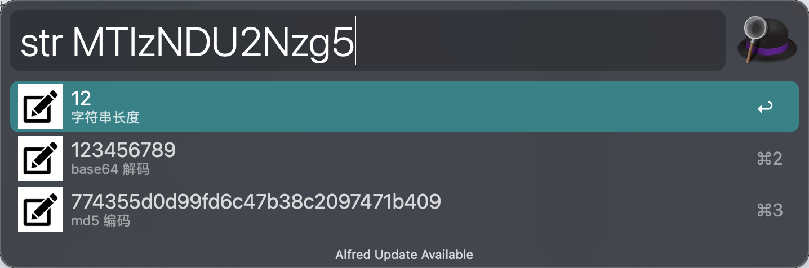
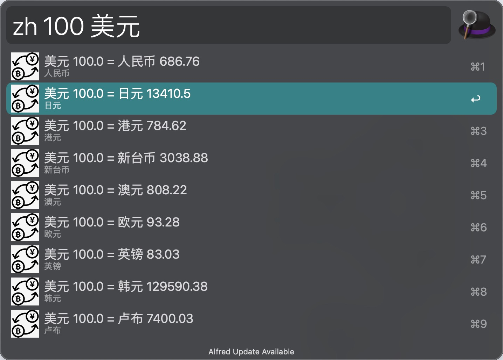

# Alfred Workflow Script
本项目只记录脚本文件，请自行创建工作流再导入脚本
## 时间工具
用于对时间戳和格式化的时间进行对应的处理([代码](tools/time_tools.py))

功能
- `输入`：时间戳；`输出`：3 种格式化时间、星期、月份
- `输入`：格式化时间；`输出`：时间戳、3 种格式化时间、星期、月份

## IP 工具
用于查找 IP 对应的信息([代码](tools/ip_tools.py))

功能
- `输入`：ip 地址；`输出`：ip 地址对应的信息

## 个人信息
用于获取我的个人信息包括手机、邮箱、地址等([代码](info/my_info.py))

功能
- `输入`：不输入任何信息；`输出`：所有个人信息
- `输入`：需要的信息，例如 `qq`、`邮箱`（支持模糊匹配）；`输出`：对应的信息

## 书签查找
支持模糊匹配快速搜索常用网站([代码](info/my_bookmarks.py))

功能
- `输入`：关键词；`输出`：匹配的网址内容

## 个人信息随机生成
用于随机生成个人信息([代码](tools/faker_tools.py))

功能
- `输入`：姓名、地址、邮箱、电话、公司、all；`输出`：随机生成的信息

## 字符串工具
用于解析字符串

功能
- `输入`：字符串；`输出`：解析结果

## 汇率转换
用于不同国家的货币转换
功能
- `输入`: 国家 金额；`输出`: 不同国家转换后对应的金额
- `输入`: 国家_1 国家_2 金额；`输入`: 国家_1 转换为 国家_2 对应的金额

